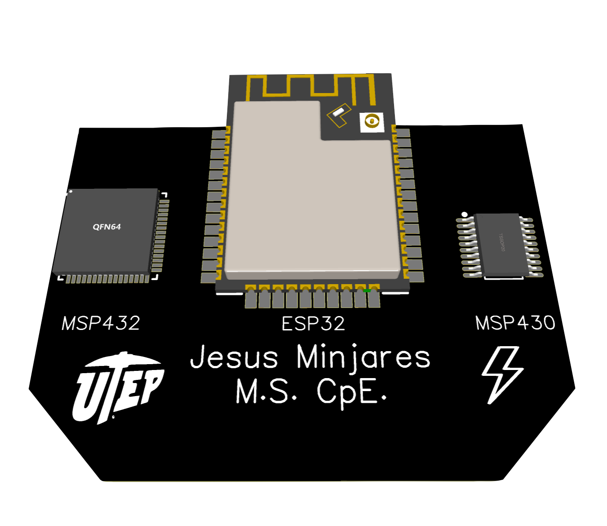

 

  

## ***Jesus Minjares :zap:***
I'm a graduate student pursing a *Master of Science in Computer Engineering* at **Univeristy of Texas at El Paso (UTEP)**. I love embedded systems! The interaction between software and hardware intrigues as you need to understand both to create complex systems! :zap: 

## ***Recent Projects***

## **Microcontrollers**

- **Texas Instrument**
  - [x] *MSP430*
  - [x] *MSP432*
  - [x] *TIVA C*
- **Espressif**
  - [x] *ESP32*
  - [x] *ESP8266*
- **Rasperry Pi**
  - [ ] *Rasperry Pi Pico*
- **STMicroelectronics**
  - [ ] *STM32*
## **Coding Languages**

 

## **Top Languages**

## **GitHub Stats** 

## **Visitor Count**

### ***Contact with me:***
---
- [LinkedIn](https://www.linkedin.com/in/jesus-minjares-157a21195/)
- Email:  jminjares4@miners.utep.edu
- Github: https://github.com/jminjares4
